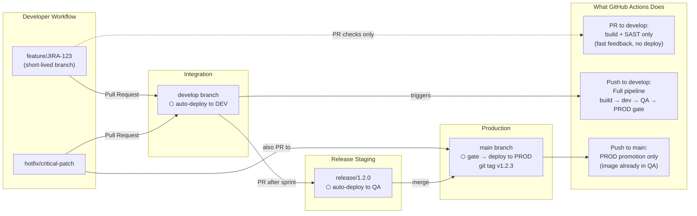
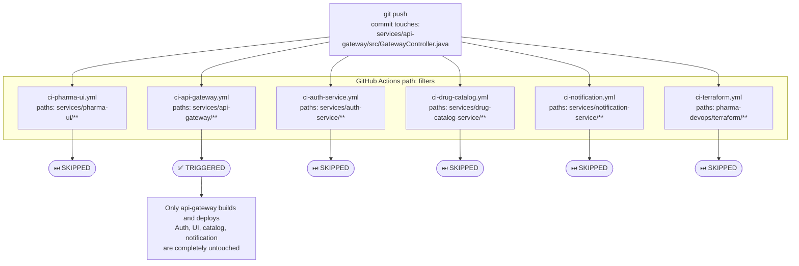
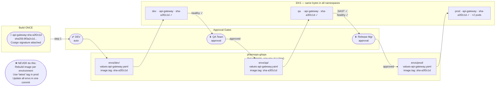
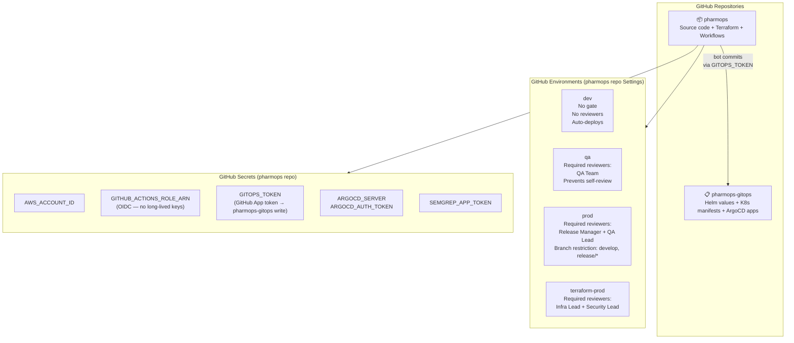

# PharmOps — CI/CD Architecture

> **Stack**: GitHub Actions (CI + Promotion) · AWS ECR · ArgoCD (CD) · AWS EKS  
> **Pattern**: GitOps · Build Once Deploy Many · Manual Stage Gates · Image Signing  
> **Equivalent to**: Spinnaker pipeline with Manual Judgment stages — reimplemented GitOps-native

---

## 1. System Overview

```mermaid
flowchart LR
    DEV(["👨‍💻 Developer"])

    subgraph SRC["📦 pharmops  —  Source Repo"]
        direction TB
        SVCS["5 Microservices\npharma-ui · api-gateway · auth-service\ndrug-catalog · notification-service"]
        WFS["⚙️ .github/workflows/\nci-api-gateway.yml\nci-auth-service.yml\nci-drug-catalog.yml\nci-notification.yml\nci-pharma-ui.yml\nci-terraform.yml"]
        TF["🏗️ Terraform IaC\nEKS · VPC · RDS · ECR · IAM"]
    end

    subgraph CI["⚙️ GitHub Actions Runner"]
        direction TB
        PIPE["Build → SAST → Trivy → Sign → Push\n+\nDeploy DEV → Gate → QA → Gate → PROD"]
    end

    subgraph REG["🗄️ AWS ECR"]
        IMG["api-gateway:sha-a3f2c1d\n+ Cosign signature OCI artifact\n+ Rekor transparency log entry"]
    end

    subgraph GOPS["📋 pharmops-gitops  —  GitOps Repo"]
        direction TB
        GD["envs/dev/values-api-gateway.yaml\nimage.tag: sha-a3f2c1d"]
        GQ["envs/qa/values-api-gateway.yaml\nimage.tag: sha-a3f2c1d"]
        GP["envs/prod/values-api-gateway.yaml\nimage.tag: sha-a3f2c1d"]
        HC["helm-charts/ (shared Helm chart)"]
    end

    subgraph ARGO["🔄 ArgoCD  —  GitOps Engine"]
        direction TB
        AD["api-gateway-dev\nAuto Sync · selfHeal"]
        AQ["pharma-qa\nAuto Sync · selfHeal"]
        AP["pharma-prod\n⚠️ Manual Sync only"]
    end

    subgraph EKS["☸️ AWS EKS Cluster  (us-east-1)"]
        direction TB
        ND["namespace: dev\napi-gateway pod · sha-a3f2c1d"]
        NQ["namespace: qa\napi-gateway pod · sha-a3f2c1d"]
        NP["namespace: prod\napi-gateway pods ×2 · sha-a3f2c1d\nHPA: 2–5 replicas"]
    end

    subgraph SEC["🔐 Security Infrastructure"]
        SM["AWS Secrets Manager\ndb-credentials · jwt-secret"]
        ESO["External Secrets Operator\n(IRSA → pulls secrets at pod start)"]
    end

    DEV -->|"git push develop"| SRC
    SRC -->|"path filter\ntriggers only\nchanged service"| CI
    CI -->|"cosign signed\nimage push"| REG
    CI -->|"bot commit\nper-env values file\none at a time"| GOPS
    GOPS -->|"ArgoCD polls\nevery 3 min\nor webhook"| ARGO
    REG -->|"image pull\n+ cosign verify\nat admission"| EKS
    ARGO -->|"helm upgrade\nrolling deploy"| EKS
    SM --> ESO --> EKS
```



---

## 2. Branching Strategy



---

## 3. Per-Service Path Filter — How One Commit Triggers One Workflow



---

## 4. CI Pipeline — Detailed Stages with Security Gates

```mermaid
flowchart TB
    TRIGGER(["git push to develop\npath: services/api-gateway/**"])

    subgraph BUILD["📋 Job: build   —   runs on every push + PR"]
        direction TB
        B1["🔨 Maven build\nUnit tests · Coverage gate ≥ 80%"]
        B2["🔍 CodeQL\nJava security-extended queries"]
        B3["🔍 Semgrep\njava · owasp-top-ten · spring-boot rules"]
        B4["🔍 OWASP Dependency Check\nfail if CVSS ≥ 7.0"]
        B5["🐳 Docker build\nmulti-stage · non-root user 1000"]
        B6["🛡️ Trivy image scan\nfail on HIGH / CRITICAL CVEs"]
        B7["⬆️ ECR push\napi-gateway:sha-a3f2c1d"]
        B8["✍️ Cosign keyless sign\nGitHub OIDC → Fulcio cert → Rekor log\nno long-lived keys"]
        OUT(["output → image_tag = sha-a3f2c1d"])
        B1 --> B2 --> B3 --> B4 --> B5 --> B6 --> B7 --> B8 --> OUT
    end

    subgraph DEV_JOB["📋 Job: deploy-dev   —   environment: dev  (no approval gate)"]
        direction TB
        D1["🤖 bot commit to pharmops-gitops\nenvs/dev/values-api-gateway.yaml\nimage.tag: sha-a3f2c1d"]
        D2["⏳ argocd app wait api-gateway-dev\n--health --sync --timeout 300\nCI runner blocks until pod is Healthy"]
        D3["🌐 smoke test\nGET /api/actuator/health → status UP"]
        D1 --> D2 --> D3
    end

    subgraph QA_JOB["📋 Job: promote-qa   —   environment: qa"]
        direction TB
        QG["⏸️ MANUAL APPROVAL GATE\nGitHub notifies QA Team\nreviewer clicks Approve in GitHub UI\n(equivalent to Spinnaker Manual Judgment)"]
        Q1["🤖 bot commit to pharmops-gitops\nenvs/qa/values-api-gateway.yaml\nimage.tag: sha-a3f2c1d   ← SAME image, no rebuild"]
        Q2["⏳ argocd app wait pharma-qa\n--health --sync --timeout 600"]
        Q3["🔍 OWASP ZAP API Scan  (DAST)\ntarget: qa.pharma.internal/api\nfail on new HIGH findings"]
        QG --> Q1 --> Q2 --> Q3
    end

    subgraph PROD_JOB["📋 Job: promote-prod   —   environment: prod"]
        direction TB
        PG["⏸️ MANUAL APPROVAL GATE\nGitHub notifies Release Manager\nreviewer clicks Approve in GitHub UI\n(prevent-self-review enforced)"]
        P1["🤖 bot commit to pharmops-gitops\nenvs/prod/values-api-gateway.yaml\nimage.tag: sha-a3f2c1d   ← SAME image, no rebuild"]
        P2["📋 ArgoCD pharma-prod → OutOfSync\nEngineer opens ArgoCD UI\nclicks Sync at maintenance window"]
        PG --> P1 --> P2
    end

    TRIGGER --> BUILD
    BUILD -->|"needs: build\ndevelop branch only"| DEV_JOB
    DEV_JOB -->|"needs: deploy-dev"| QA_JOB
    QA_JOB -->|"needs: promote-qa"| PROD_JOB
```



---

## 5. The Core Principle — One Image Tag Through All Environments



---

## 6. Security Gates — Where Every Tool Plugs In

```mermaid
flowchart LR
    subgraph PRE["Pre-Commit\n(developer machine)"]
        GS["gitleaks\ndetect-secrets\n(block credential leaks\nbefore push)"]
    end

    subgraph PR_STAGE["Pull Request\n(SAST)"]
        CQ["CodeQL\n(Java / JS)"]
        SM["Semgrep\n(owasp-top-ten\nspring-boot rules)"]
        OW["OWASP\nDependency Check\n(fail CVSS ≥ 7.0)"]
    end

    subgraph BUILD_STAGE["Docker Build\n(Container SAST)"]
        TV["Trivy\n(image + filesystem)\nfail HIGH/CRITICAL"]
        ECR_SC["ECR scan-on-push\n(async alert)"]
    end

    subgraph SIGN_STAGE["After ECR Push\n(Supply Chain)"]
        CS["Cosign keyless\n(GitHub OIDC)\nSigns sha256 digest\nRekor audit log"]
    end

    subgraph DEPLOY_STAGE["Post-Deploy\n(DAST)"]
        ZAP_B["ZAP Baseline\n(dev — passive\nnon-blocking)"]
        ZAP_F["ZAP API Scan\n(QA — active\nblocks promotion)"]
    end

    subgraph RUNTIME["Runtime\n(Cluster)"]
        KV["Kyverno policy\nblocks unsigned\nimages"]
        FA["Falco\nruntime anomaly\ndetection"]
        OPA["OPA Gatekeeper\ndenies non-compliant\npod specs"]
    end

    subgraph IAC["IaC\n(Terraform)"]
        CK["Checkov\n(fail on\nCRITICAL findings)"]
        TF_SEC["tfsec"]
    end

    PRE --> PR_STAGE --> BUILD_STAGE --> SIGN_STAGE --> DEPLOY_STAGE --> RUNTIME
    IAC -->|"separate\nci-terraform.yml"| RUNTIME
```



---

## 7. Spinnaker vs This Stack — Concept Mapping

| Spinnaker Concept | This Stack Equivalent |
|---|---|
| **Pipeline** | GitHub Actions workflow (`.github/workflows/ci-api-gateway.yml`) |
| **Bake Stage** | `_java-build.yml` reusable workflow — build + push |
| **Deploy Stage** | `deploy-dev` / `promote-qa` / `promote-prod` jobs |
| **Manual Judgment Stage** | GitHub `environment:` with Required Reviewers |
| **Find Artifact from Execution** | `needs.build.outputs.image_tag` — same SHA passed across all jobs |
| **Pipeline Trigger Chain** | `needs: [deploy-dev]` → `needs: [promote-qa]` job dependency |
| **Single image through all stages** | `image_tag: sha-a3f2c1d` written to dev → qa → prod values files |
| **Automated Canary Analysis** | Argo Rollouts (Phase 2 addition) |
| **Multi-stage visual dashboard** | Kargo (Phase 2 addition) |

---

## 8. GitHub Repository & Environment Setup



---

## 9. Workflow File Map

```
pharmops/
└── .github/
    ├── actions/
    │   └── update-gitops/
    │       └── action.yml          ← Composite: clone gitops → yq patch → git push
    └── workflows/
        ├── _java-build.yml         ← Reusable: Maven build + CodeQL + OWASP + Trivy + Cosign + ECR
        ├── _node-build.yml         ← Reusable: npm build + CodeQL + npm audit + Trivy + Cosign + ECR
        ├── ci-api-gateway.yml      ← Trigger (services/api-gateway/**) + full promote chain
        ├── ci-auth-service.yml     ← Trigger (services/auth-service/**) + full promote chain
        ├── ci-drug-catalog.yml     ← Trigger (services/drug-catalog-service/**) + QA/prod seed
        ├── ci-notification.yml     ← Trigger (services/notification-service/**) + Node pipeline
        ├── ci-pharma-ui.yml        ← Trigger (services/pharma-ui/**) + patches raw K8s manifest
        └── ci-terraform.yml        ← Trigger (pharma-devops/terraform/**) + Checkov + plan/apply

pharmops-gitops/
├── argocd/apps/
│   ├── dev/                        ← 5 individual ArgoCD Application files (per-service)
│   ├── qa/pharma-qa-app.yaml       ← Single QA app watches envs/qa/
│   └── prod/pharma-prod-app.yaml   ← Single prod app (syncPolicy: Manual)
├── envs/
│   ├── dev/   values-<service>.yaml  ← image.tag: sha-xxx (auto-updated by CI)
│   ├── qa/    values-<service>.yaml  ← image.tag: sha-xxx (updated after QA approval)
│   └── prod/  values-<service>.yaml  ← image.tag: sha-xxx (updated after prod approval)
├── helm-charts/                    ← Shared Helm chart for all Spring Boot / Node services
└── k8s-manifests/pharma-ui/       ← Raw K8s manifests for pharma-ui (no Helm)
```

---

## 10. End-to-End Flow Summary

```
Developer pushes code
        │
        ▼  (path filter: only changed service workflow triggers)
GitHub Actions: build + SAST + Trivy + Cosign sign + ECR push
        │
        │  image: api-gateway:sha-a3f2c1d  (one image, never rebuilt)
        │
        ▼
[auto] Update envs/dev/values-api-gateway.yaml → sha-a3f2c1d
        │
        ▼  ArgoCD api-gateway-dev detects diff → helm upgrade → rolling deploy
        │
        ▼  CI waits: argocd app wait --health (blocks runner until pod healthy)
        │
        ▼  smoke test passes
        │
⏸ PAUSE — GitHub notifies QA Team → reviewer clicks Approve
        │
        ▼
[approved] Update envs/qa/values-api-gateway.yaml → sha-a3f2c1d  (SAME)
        │
        ▼  ArgoCD pharma-qa detects diff → helm upgrade → rolling deploy
        │
        ▼  CI waits: argocd app wait --health
        │
        ▼  OWASP ZAP DAST scan passes
        │
⏸ PAUSE — GitHub notifies Release Manager → reviewer clicks Approve
        │
        ▼
[approved] Update envs/prod/values-api-gateway.yaml → sha-a3f2c1d  (SAME)
        │
        ▼  ArgoCD pharma-prod shows OutOfSync
        │
        ▼  Engineer opens ArgoCD UI → clicks Sync at maintenance window
        │
        ▼  Rolling deploy in prod namespace (2 replicas, pod anti-affinity)
        │
        ✓  DONE — same sha-a3f2c1d running in dev, qa, and prod
```

---

*Generated for pharmops project · Phase 1: GitHub Actions + ArgoCD*  
*Phase 2 upgrade path: Add Kargo for Spinnaker-style visual promotion dashboard*